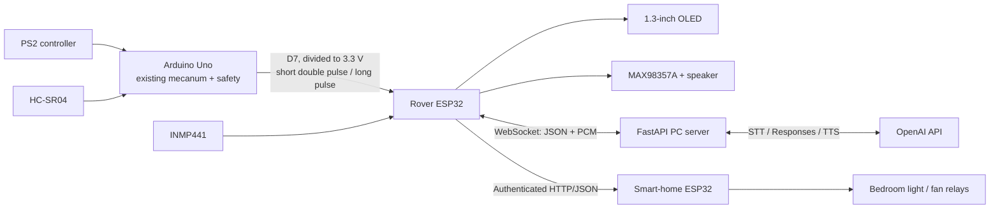

# AURA Rover

**Intelligent Voice-Controlled Mobile Assistant for Smart Living**  
ACCCIM STI Competition 2026

AURA adds voice interaction, an OLED emotion display, obstacle safety, Wi-Fi AI conversation, and smart-home control to an already-working PS2 mecanum rover. It deliberately does **not** replace or redesign the existing mecanum drive code.

## What is implemented

- A reusable Arduino Uno safety module for HC-SR04 sensing, immediate motor-stop callbacks, and a one-wire event link.
- A directly uploadable integration of the supplied `mecanum_car_v2.3.ino`, with its original drive behavior preserved.
- Rover ESP32 firmware for two independent I2S buses (microphone and speaker), WebSocket audio streaming, OLED faces, safety warnings, and smart-home commands.
- Smart-home ESP32 firmware with authenticated, idempotent HTTP/JSON relay control.
- A FastAPI PC server using the OpenAI Audio and Responses APIs, hosted web search for online research, local Cognee long-term memory, deterministic safety-critical home-command recognition, structured AI output, and PCM speech streaming.
- JSON Schemas, wiring tables, architecture notes, bring-up roadmap, risk register, and tests.

## System at a glance



The Uno is the safety authority. An obstacle stops the motors even if Wi-Fi, the PC, or the AI is unavailable.

## Repository map

```text
AURA-Rover/
|-- docs/                         Architecture, wiring, protocols, plans
|-- firmware/
|   |-- uno_integration/          Drop-in module for the existing rover sketch
|   |-- rover_esp32/              Voice/OLED/network firmware
|   \-- smart_home_esp32/         Relay-node firmware
|-- pc_server/                    Python/FastAPI/OpenAI application
\-- protocol/schemas/             Machine-readable JSON Schemas
```

## Quick start

For a complete beginner-friendly procedure, follow [STEP_BY_STEP_GUIDE.md](docs/STEP_BY_STEP_GUIDE.md).

1. Read [wiring.md](docs/wiring.md), especially the power and 5 V-to-3.3 V divider notes.
   For the supplied mecanum sketch, use the corrected pin plan in [YOUR_MECANUM_CODE_INTEGRATION.md](docs/YOUR_MECANUM_CODE_INTEGRATION.md).
   To test only the rover ESP32 and its peripherals first, use [ESP32_ONLY_TEST.md](docs/ESP32_ONLY_TEST.md).
   To let AURA answer current online questions, enable [ONLINE_RESEARCH.md](docs/ONLINE_RESEARCH.md).
   To let AURA remember explicit facts, enable [COGNEE_MEMORY.md](docs/COGNEE_MEMORY.md).
2. Add `firmware/uno_integration/src/AuraSafety.*` to the existing Uno project and follow the integration example. Map the stop callback to the existing motor-stop function and one unused PS2 button to `voicePressed`.
3. Copy each ESP32 `include/secrets.example.h` to `include/secrets.h`, then set Wi-Fi, server, node, and token values.
4. Install PlatformIO, build, and upload each ESP32 project from its own directory.
5. On the PC:

   ```powershell
   cd pc_server
   python -m venv .venv
   .\.venv\Scripts\Activate.ps1
   pip install -e ".[dev]"
   Copy-Item .env.example .env
   # Edit .env and add OPENAI_API_KEY plus the same ROVER_TOKEN.
   aura-server
   ```

6. Open `http://<PC-IP>:8000/health`, power the rover, and use the serial logs to confirm connection.

Detailed staged bring-up is in [roadmap.md](docs/roadmap.md). Do not test with the wheels touching the floor until the safety-stop test passes.

## Default OpenAI pipeline

- Speech-to-text: `gpt-4o-mini-transcribe`
- Conversation and structured intent: `gpt-5.5`, low-latency reasoning setting
- Online research: Responses API hosted `web_search` tool, enabled by `AURA_ENABLE_WEB_SEARCH=true`
- Long-term memory: local Cognee JSON store, enabled by `AURA_ENABLE_COGNEE=true`
- Text-to-speech: `gpt-4o-mini-tts`, raw 24 kHz mono PCM

All model IDs are environment variables. The PC, not either microcontroller, holds the OpenAI API key.

## Safety boundary

This is a competition prototype, not a certified safety system. Always provide a physical battery disconnect, test with the rover raised, use relay modules with proper isolation and enclosure, and have a qualified adult supervise any mains-voltage work.

