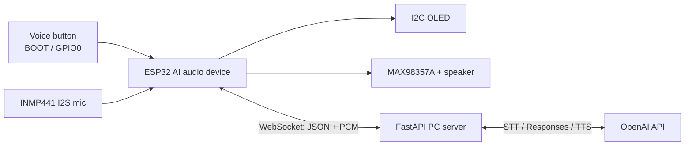

# AURA Wireless AI Mic + Speaker

ESP32 wireless microphone and speaker for talking with an AI assistant over Wi-Fi.

AURA captures speech from an INMP441 I2S microphone, streams raw PCM to a FastAPI PC server over WebSocket, uses OpenAI for transcription, conversation, optional web search, memory, and text-to-speech, then streams 24 kHz PCM audio back to a MAX98357A speaker amplifier.

## What is included

- Standalone ESP32 firmware for Wi-Fi, I2S microphone capture, I2S speaker playback, OLED status faces, and button-triggered voice turns.
- A FastAPI PC server that handles WebSocket audio, OpenAI transcription, Responses API conversation, optional hosted web search, optional local Cognee-style memory, and PCM speech output.
- JSON schemas for the audio start message and AI decision payload.
- Hardware wiring, setup, and protocol notes for the AI mic/speaker device.

## System at a glance



The OpenAI API key stays on the PC. The ESP32 only knows the Wi-Fi credentials, PC LAN address, device id, and shared device token.

## Repository map

```text
project-root/
|-- docs/
|   |-- setup.md
|   |-- wiring.md
|   \-- protocol.md
|-- firmware/
|   \-- ai_audio_esp32/
|-- pc_server/
\-- protocol/
    \-- schemas/
```

## Quick start

1. Wire the ESP32, INMP441, MAX98357A, OLED, and voice button using [docs/wiring.md](docs/wiring.md).
2. Copy `firmware/ai_audio_esp32/include/secrets.example.h` to `firmware/ai_audio_esp32/include/secrets.h`.
3. Set `WIFI_SSID`, `WIFI_PASSWORD`, `PC_SERVER_HOST`, `AUDIO_DEVICE_ID`, and `AUDIO_DEVICE_TOKEN`.
4. On the PC:

   ```powershell
   cd pc_server
   python -m venv .venv
   .\.venv\Scripts\Activate.ps1
   pip install -e ".[dev]"
   Copy-Item .env.example .env
   ```

5. In `pc_server/.env`, set `OPENAI_API_KEY` and `AURA_DEVICE_TOKEN` to the same token used by `AUDIO_DEVICE_TOKEN`.
6. Start the server:

   ```powershell
   aura-server
   ```

7. Build and upload the ESP32 firmware:

   ```powershell
   pio run -d firmware\ai_audio_esp32
   pio run -d firmware\ai_audio_esp32 --target upload
   ```

8. Open `http://<PC-IP>:8000/health`, power the ESP32, then press the voice button to talk.

## Default OpenAI pipeline

- Speech-to-text: `gpt-4o-mini-transcribe`
- Conversation: `gpt-5.5`
- Online research: Responses API hosted `web_search`, enabled by `AURA_ENABLE_WEB_SEARCH=true`
- Long-term memory: local JSON store, enabled by `AURA_ENABLE_COGNEE=true`
- Text-to-speech: `gpt-4o-mini-tts`, raw 24 kHz mono PCM

All model IDs are environment variables in `pc_server/src/aura_server/config.py`.

## Notes

Keep speaker volume low while testing, power the amplifier from a stable supply, and keep microphone wiring short and away from the speaker amp output. This is a prototype audio assistant, not a certified consumer audio product.
