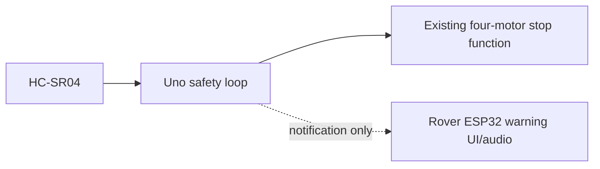
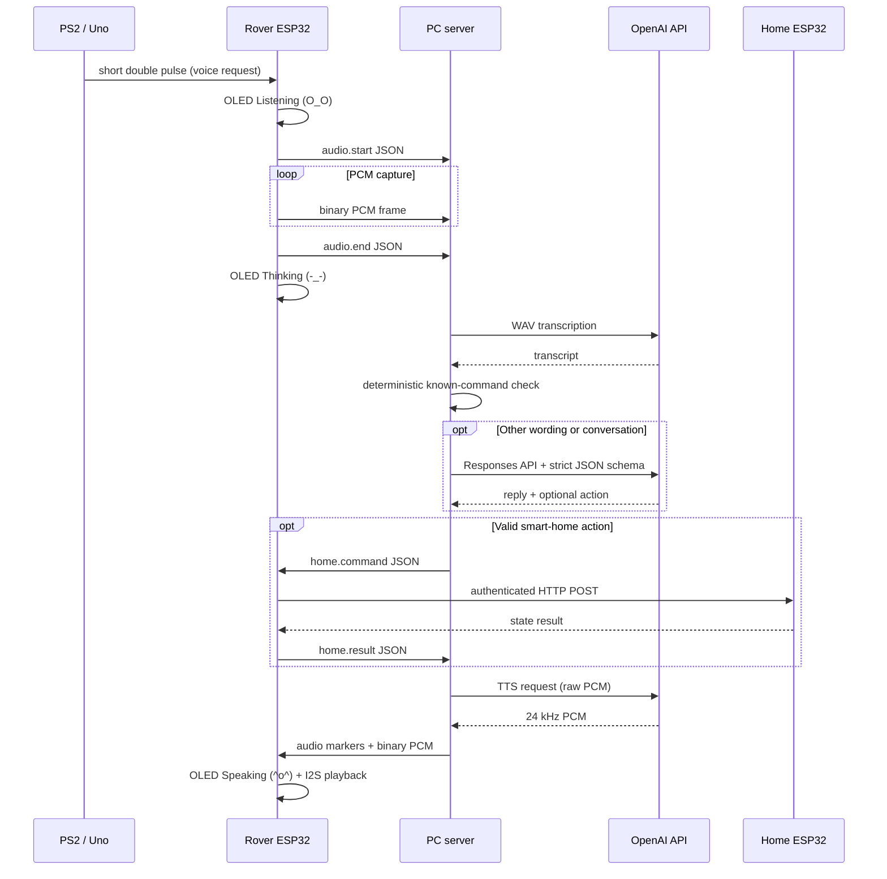
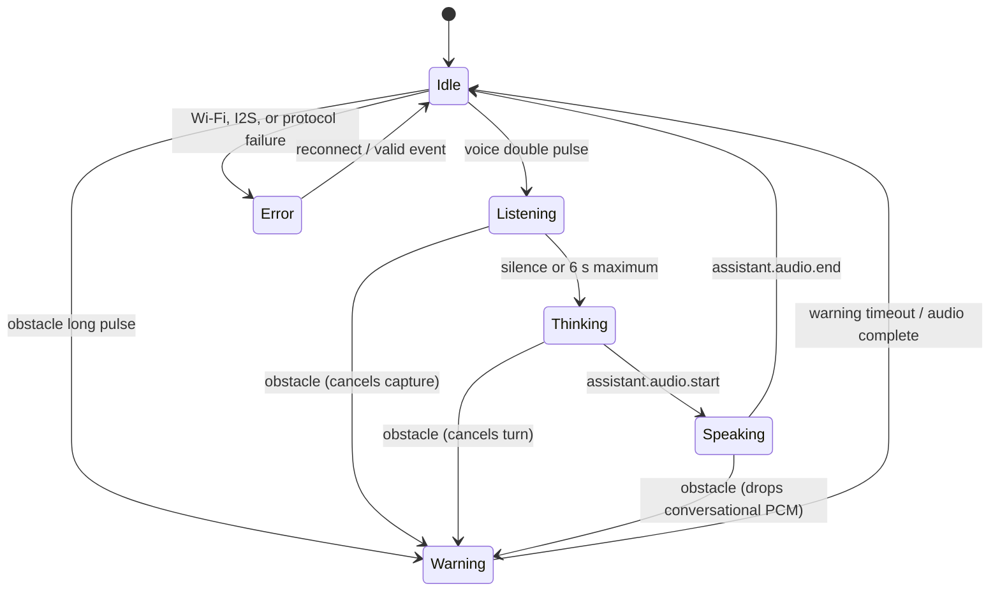

# Technical architecture

## Design goals and boundaries

AURA is an integration layer around the working PS2 mecanum rover. The wheel geometry, motor mixing, L298N wiring, and ordinary PS2 driving behavior remain owned by the existing Uno sketch.

The most important architectural rule is that collision stopping never depends on Wi-Fi, the PC, or AI:



The ESP32 notification can fail without preventing the Uno from stopping the motors.

## Responsibility split

| Controller | Owns | Must not own |
|---|---|---|
| Arduino Uno | Existing PS2/mecanum loop, HC-SR04 sampling, stop latch, motor stop callback, one-wire notification | Cloud calls, audio, smart-home relays |
| Rover ESP32 | INMP441 capture, MAX98357A playback, OLED, Wi-Fi, PC WebSocket, relay-node client, Uno event decoding | OpenAI key, primary collision stop, mains switching |
| PC | WebSocket session, WAV wrapping, transcription, command classification, conversation, TTS, diagnostics | Direct motor control |
| Smart-home ESP32 | Authenticated command validation, relay state, fail-safe boot, idempotency | Natural-language interpretation |

## End-to-end voice sequence



The exact five competition commands are classified locally on the PC before the model call. Natural variants go through a strict model-produced schema, then through Pydantic validation. Neither path can address a device outside the allowlist.

## Obstacle sequence

1. The Uno samples the HC-SR04 every 50 ms.
2. On the first valid distance at or below 25 cm, it invokes the existing all-motor stop function immediately and latches the stop.
3. The Uno asserts D7 HIGH for at least 500 ms and keeps it HIGH while the stop latch remains active.
4. After recognizing 150 ms of HIGH, the rover ESP32 shows `(>_<)`, plays a local fallback warning tone, cancels recording/playback, and informs the PC.
5. The PC returns the exact spoken phrase: "Obstacle detected. Vehicle stopped."
6. The Uno continues invoking the stop callback until three readings are clear at or above 32 cm. Clearing the sensor does not generate a drive command; the operator must command motion again.

## ESP32 state model



The OLED implementation is in `firmware/rover_esp32/src/EmotionDisplay.cpp`. It renders the required ASCII faces with a status label, making it readable and independent of custom font assets.

## Firmware module breakdown

### Uno integration

| Module | Purpose |
|---|---|
| `AuraSafety` | Sonar schedule, threshold/hysteresis, immediate stop callback, voice-button edge detection, one-wire event scheduler |
| Existing sketch | PS2X reads, mecanum mixing, L298N outputs, real stop function |

`AuraSafety` is a library because the original working motor pin map and sketch were not supplied. This is the only production-safe way to avoid silently replacing tested drive behavior: the module calls the rover's own known-good stop function.

After the original `mecanum_car_v2.3.ino` was supplied, a second directly uploadable integration was added under `firmware/uno_mecanum_aura`. It preserves the original drive calculations, moves only the conflicting right-front IN1 wire from D7 to D3, and uses D11 for NewPing one-pin sonar operation.

### Rover ESP32

| Module | Purpose |
|---|---|
| `AlertDecoder` | Distinguishes the one-wire short-double voice pattern from a long obstacle pulse |
| `AudioIO` | I2S_NUM_0 microphone RX, 16 kHz PCM conversion/RMS, I2S_NUM_1 24 kHz speaker TX, offline alert tone |
| `EmotionDisplay` | U8g2 OLED faces and labels |
| `HomeClient` | Authenticated HTTP/JSON command to relay node |
| `RoverApp` | Wi-Fi/WebSocket lifecycle, audio and emotion state machines, protocol dispatch |

### Smart-home ESP32

| Module | Purpose |
|---|---|
| `RelayController` | Active-level abstraction, boot-off behavior, allowlisted devices |
| HTTP application | Bearer authentication, JSON validation, eight-request idempotency cache, health endpoint |

### PC server

| Python module | Purpose |
|---|---|
| `app.py` | FastAPI health route, authenticated WebSocket, task cancellation, protocol routing |
| `audio.py` | Bounded PCM accumulation and correct WAV header generation |
| `intent.py` | Deterministic classifier for the five required commands |
| `cognee.py` | Local explicit long-term memory store and memory voice commands |
| `ai.py` | OpenAI transcription, Responses structured output, TTS, cached warning speech |
| `models.py` | Strict device/action types and AI JSON Schema |
| `conversation.py` | Four-turn in-memory context per rover |
| `config.py` | Environment-only secrets and model configuration |

Cognee memory is stored locally on the PC, defaults to `pc_server/data/cognee_memory.json`, and is ignored by Git. It only stores explicit memories such as "Remember that my robot is called AURA," then injects relevant saved facts into later AI turns.

## OpenAI integration

The OpenAI key exists only in the PC `.env`. The microcontrollers communicate with the PC and therefore never expose the key in flash.

As verified against the official documentation on 21 June 2026:

- File-based, bounded push-to-talk audio uses the transcription endpoint; this implementation defaults to `gpt-4o-mini-transcribe`. The official guide documents `wav` input and the current transcription models: [Speech to text](https://developers.openai.com/api/docs/guides/speech-to-text).
- The conversation/classification call uses the Responses API and strict `text.format` JSON Schema. The API returns the text through `response.output_text`: [Migrate to the Responses API](https://developers.openai.com/api/docs/guides/migrate-to-responses) and [Structured Outputs](https://developers.openai.com/api/docs/guides/structured-outputs).
- TTS defaults to `gpt-4o-mini-tts` and `pcm`; the official guide specifies raw PCM as signed 16-bit little-endian at 24 kHz: [Text to speech](https://developers.openai.com/api/docs/guides/text-to-speech).
- `gpt-5.5` is the current default model in the official latest-model guide and permits `reasoning.effort: none` for latency-critical lightweight voice turns: [Using GPT-5.5](https://developers.openai.com/api/docs/guides/latest-model).

Model names are environment variables so competition-day account availability can be tested and changed without rebuilding firmware.

## Folder structure

```text
AURA-Rover/
|-- README.md
|-- docs/
|   |-- architecture.md
|   |-- protocols.md
|   |-- risk-and-testing.md
|   |-- roadmap.md
|   \-- wiring.md
|-- firmware/
|   |-- rover_esp32/
|   |   |-- include/
|   |   |-- src/
|   |   \-- platformio.ini
|   |-- smart_home_esp32/
|   |   |-- include/
|   |   |-- src/
|   |   \-- platformio.ini
|   \-- uno_integration/
|       |-- examples/
|       |-- src/
|       \-- library.properties
|-- pc_server/
|   |-- src/aura_server/
|   |-- tests/
|   \-- pyproject.toml
\-- protocol/schemas/
```

## Operational degradation

| Failed part | Remaining behavior |
|---|---|
| OpenAI API | Rover remains PS2-driveable; Uno safety works; voice turn displays an error |
| PC or Wi-Fi | Uno safety works; ESP32 still shows the warning and plays a tone |
| Rover ESP32 | Existing PS2 drive and Uno motor stop remain functional |
| Home node | Voice conversation works; relay request returns a failure result |
| HC-SR04 disconnected | No distance is available; this is a pre-run-test failure and the rover must not run |

## Future improvements

- Replace fixed push-to-talk capture with OpenAI Realtime transcription or a local VAD once the basic system is stable.
- Add a second physical safety channel (bumper or second range sensor) and a hardware motor-enable interlock.
- Give voice-request and obstacle events separate wires if one additional GPIO becomes available; the current one-wire pulse scheme is intentionally bounded but less observable.
- Use WSS/HTTPS with device certificates on networks that are not isolated.
- Add OTA firmware signing, NVS-backed command counters, and a persistent audit log.
- Replace the lightweight Cognee JSON memory with a graph/vector memory backend if the project later needs document-scale research memory.
- Add battery voltage/current monitoring and low-battery speech warnings.
- Add on-device wake-word recognition so PS2 push-to-talk becomes optional.
- Add localization, camera perception, and navigation only as separate layers; never couple them into the Uno's emergency stop.

