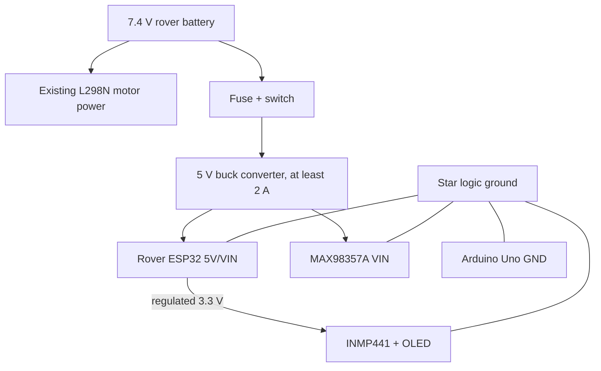

# Wiring and pin assignments

## Power first

Do not take logic power from an L298N regulator. Motor noise and voltage drop can reset the ESP32 and corrupt audio.

Recommended power tree:



- Keep motor-current return wires away from the microphone and logic ground path. Join grounds at one low-impedance star point.
- Add a 470 µF electrolytic and a 100 nF ceramic near the ESP32/amplifier 5 V input.
- Never connect two 7.4 V battery packs in series or parallel unless the packs, BMS, charger, and wiring were explicitly designed for it.
- Keep the existing rover battery arrangement unchanged unless a qualified mentor reviews it.

## Arduino Uno additions for the supplied mecanum code

`mecanum_car_v2.3.ino` already uses D7, D8, and D9 for the right-front motor. The verified integration therefore moves only `RF_IN1` from D7 to D3 and uses NewPing one-pin mode on D11.

| Function | Uno pin | Other end | Electrical note |
|---|---:|---|---|
| Right-front motor IN1 | D3 | Existing L298N IN1 wire moved from D7 | D3 is used as an ordinary digital output |
| HC-SR04 shared signal | D11 | TRIG directly and ECHO through 2.2 kΩ | NewPing one-pin mode |
| HC-SR04 power | 5V | VCC | Sensor only |
| HC-SR04 ground | GND | GND | Shared logic ground |
| ESP32 event output | D7 | Divider top | Never connect directly to ESP32 |

Do not connect the HC-SR04 to D8/D9 with this rover. Exact instructions and the final full pin map are in `YOUR_MECANUM_CODE_INTEGRATION.md`.

## Uno D7 to ESP32 GPIO25 divider

```text
Uno D7 (5 V) ---- 10 kOhm ----+---- ESP32 GPIO25
                              |
                            20 kOhm
                              |
Shared GND -------------------+
```

The node is approximately `5 V × 20/(10+20) = 3.33 V`. Place the divider close to the ESP32 and verify it with a multimeter before connecting GPIO25. The lower 20 kΩ resistor also provides a defined LOW if the Uno output is high-impedance during reset.

## Rover ESP32 pin map

| ESP32 pin | Peripheral pin | Purpose / note |
|---:|---|---|
| GPIO21 | OLED SDA | I2C data |
| GPIO22 | OLED SCL | I2C clock |
| 3V3 | OLED VCC | Use 3.3 V unless the module explicitly requires otherwise |
| GND | OLED GND | Shared logic ground |
| GPIO26 | INMP441 SCK/BCLK | I2S_NUM_0 microphone clock |
| GPIO27 | INMP441 WS/LRCL | I2S_NUM_0 word select |
| GPIO34 | INMP441 SD | Input-only pin, ideal for microphone data |
| 3V3 | INMP441 VDD | Do not power from 5 V |
| GND | INMP441 GND | Shared logic ground |
| GND | INMP441 L/R | Selects left channel; firmware reads left |
| GPIO14 | MAX98357A BCLK | I2S_NUM_1 speaker clock |
| GPIO13 | MAX98357A LRC | I2S_NUM_1 word select |
| GPIO32 | MAX98357A DIN | I2S_NUM_1 audio data |
| Regulated 5V | MAX98357A VIN | Supports useful 4 Ω speaker power |
| GND | MAX98357A GND | Shared logic ground |
| Speaker + / − | MAX98357A SPK+ / SPK− | The output is bridged; neither speaker lead goes to GND |
| GPIO25 | Divider node | One-wire event input from Uno D7 |
| 5V/VIN | 5 V buck | ESP32 board input, not raw battery |

The firmware assumes a common 1.3-inch SH1106 128×64 OLED at address `0x3C`. If the display is SSD1306, change the U8g2 constructor in `EmotionDisplay.h` to `U8G2_SSD1306_128X64_NONAME_F_HW_I2C`; all drawing code remains the same. Run an I2C scanner if the module is blank—some boards use `0x3D`.

The INMP441 and MAX98357A use separate ESP32 I2S controllers, so microphone capture and playback do not fight over clocks or sample rates.

## Smart-home ESP32 pin map

| ESP32 pin | Relay module | Logical device |
|---:|---|---|
| GPIO26 | IN1 | `bedroom_light` |
| GPIO27 | IN2 | `fan` |
| GND | GND | Common low-voltage ground |
| Module-rated supply | VCC/JD-VCC | Follow the specific relay board datasheet |

The code defaults to active-LOW relay inputs and drives both relays OFF before starting Wi-Fi. Test the active level using LEDs or a low-voltage lamp first.

### Mains-voltage boundary

Do not put mains wiring on a solderless breadboard. Use an enclosed, certified relay/contactor module with fusing, strain relief, protected earth where required, physical separation between low and high voltage, and qualified adult supervision. For a school demo, low-voltage lamps and fans are the safer choice.

## Pre-power continuity checklist

- All grounds that carry logic signals are common.
- No raw 7.4 V reaches an ESP32, microphone, OLED, or Uno 5 V pin.
- The D7 divider measures near 3.3 V, not 5 V, when D7 is HIGH.
- The MAX98357A speaker outputs go only to the speaker.
- Relay outputs are unloaded or connected only to a safe low-voltage test load.
- Rover is lifted so all four wheels can spin freely during first firmware tests.
